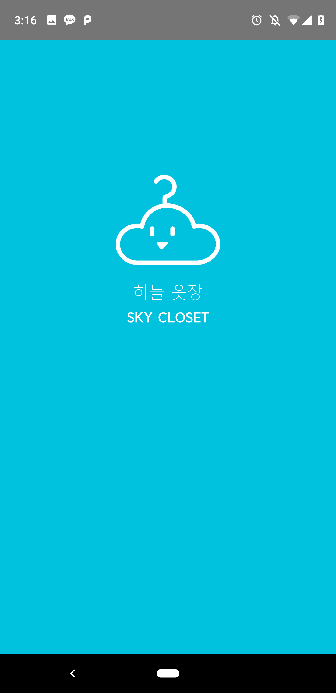
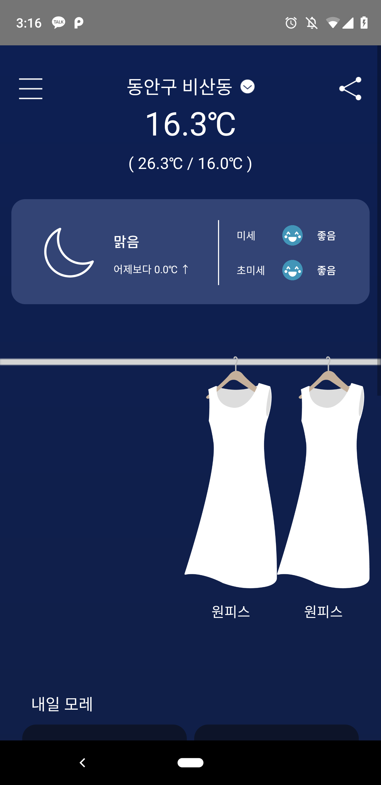

# \[ 🚧 Work in progress 👷‍♀️⛏👷🔧 🚧 \] SkyCloset 2.1 
<p>
  
  <a href="https://github.com/orange-mush/skycloset_cli#readme">
    
  </a>
  <a href="https://github.com/orange-mush/skycloset_cli/graphs/commit-activity">
    
  </a>
  <a href="https://github.com/orange-mush/skycloset_cli/blob/master/LICENSE">
    
  </a>
  <a href="https://github.com/orange-mush">
    
  </a>
</p>

👍 Comments and new issues created are welcomed.

🛑 We're currently not accepting external PRs that touch on the app's architecture.

> React-Native based / For Android only

- [수정] 날씨별 comment 다양화
- [추가] 내 체감온도 설정 기능 
- [수정] 일부 해상도의 margin, 배치 관련 issue 해결
- [추가] 후원하기 기능 및 광고

---

# SkyCloset 2.0


> *Recommend clothes for today's weather*

'Skycloset' is a closest MD which makes your day pleasant. At the beginning of the day, it gives brief weather information and recommends clothes with the appropriate thickness for today's wear. You can check this by time zone. Also, at the end of the day, this app receives satisfaction from the day and grows every day to suit you better.

**[Install on Google Play](https://play.google.com/store/apps/details?id=com.skycloset)**
(링크 변경해야함)


### Made by
* DESIGN : [Yeongmi Yoon](https://github.com/Mimimiiim)
* DEV : [Sumin Choi](https://github.com/orange-mush)
* PLANNER : Jiyun Lee, Haewon Seong


### Non-Goals
Skycloset is a small project for Demoday of CEOS, so it has limited manpower and time. In order to fully implement the features required to run the app under these conditions, it explicitly does not attempt to:
* Supports **IOS** environments; Doing so is entirely possible, but complicates things.
* Support **pre-JellyBean** devices; React Native apps target iOS 9.0 and Android 4.1 (API 16) or newer.


### Screenshots

  


### Libraries
1. [react-navigation](https://github.com/react-navigation/react-navigation)
2. [react-native-geolocation-service](https://github.com/Agontuk/react-native-geolocation-service)
3. [react-native-async-storage](https://github.com/react-native-community/react-native-async-storage)


### API services
1. [Google Geocoding API](https://developers.google.com/maps/documentation/geocoding/start)
2. [Dark Sky](https://darksky.net/dev)
3. [Air Korea](http://openapi.airkorea.or.kr/)
4. [SGIS Open API](https://sgis.kostat.go.kr/developer/html/home.html)


### Citations
1. [논문 : 기후변화와 관광수요 관계에 관한 연구: 기후쾌적성을 중심으로](http://kiss.kstudy.com/thesis/thesis-view.asp?key=3506533)
2. [논문 : 의복의 쾌적성 평가를 위한 상반신에서의 의복기후분포](http://kiss.kstudy.com/thesis/thesis-view.asp?key=3337257)
3. [논문 : 사무실에서 작업시 의복의 쾌적성 평가를 위한 의복기후의 계절변화 측정](http://kiss.kstudy.com/thesis/thesis-view.asp?key=1926054)
4. [blog : 습도를 반영한 온도지표 만들기](https://m.blog.naver.com/newils2002/220945893689)


### License


```
MIT License

Copyright (c) 2019 Sumin Choi

Permission is hereby granted, free of charge, to any person obtaining a copy
of this software and associated documentation files (the "Software"), to deal
in the Software without restriction, including without limitation the rights
to use, copy, modify, merge, publish, distribute, sublicense, and/or sell
copies of the Software, and to permit persons to whom the Software is
furnished to do so, subject to the following conditions:

The above copyright notice and this permission notice shall be included in all
copies or substantial portions of the Software.

THE SOFTWARE IS PROVIDED "AS IS", WITHOUT WARRANTY OF ANY KIND, EXPRESS OR
IMPLIED, INCLUDING BUT NOT LIMITED TO THE WARRANTIES OF MERCHANTABILITY,
FITNESS FOR A PARTICULAR PURPOSE AND NONINFRINGEMENT. IN NO EVENT SHALL THE
AUTHORS OR COPYRIGHT HOLDERS BE LIABLE FOR ANY CLAIM, DAMAGES OR OTHER
LIABILITY, WHETHER IN AN ACTION OF CONTRACT, TORT OR OTHERWISE, ARISING FROM,
OUT OF OR IN CONNECTION WITH THE SOFTWARE OR THE USE OR OTHER DEALINGS IN THE
SOFTWARE.
```